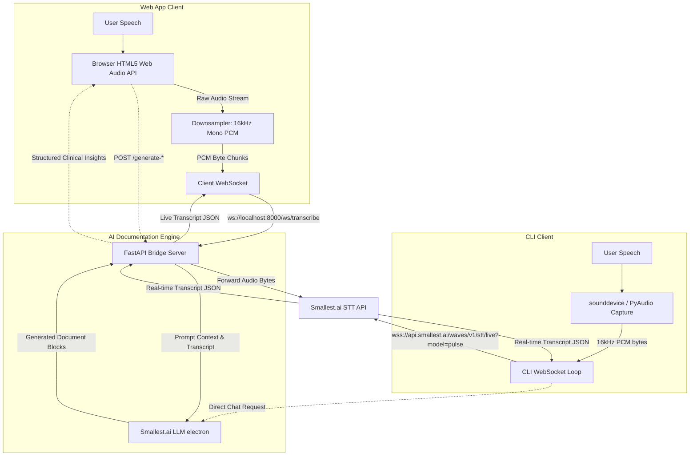

# AscribeMD 🩺 - AI Clinical Medical Scribe

AscribeMD is a production-grade, real-time clinical AI scribe application designed to simplify medical documentation for healthcare providers. By listening to doctor-patient consultations, AscribeMD streams audio over WebSockets to transcribe speech in real time, then leverage the advanced Smallest.ai `electron` Large Language Model to compile structured **SOAP Notes**, **Consultation Summaries**, and **Prescription Drafts**.

---

## 🏗️ System Architecture & Data Flow

AscribeMD supports two modes of operation:
1. **Interactive Web Dashboard**: React frontend captures audio via the HTML5 Web Audio API, downsamples it to mono 16kHz PCM, streams it to a FastAPI bridge backend over WebSockets, and receives real-time transcripts.
2. **Standalone CLI Client**: A lightweight terminal utility that records mic audio using Python's `sounddevice` package and prints real-time transcription directly to the console.



---

## 📂 Project Directory Structure

- [backend/](file:///d:/Projects/speech_to_text%20-%20%20%20smalest/backend/) — FastAPI WebSocket bridge, API server, and CLI application.
  - [main.py](file:///d:/Projects/speech_to_text%20-%20%20%20smalest/backend/main.py) — Standalone Python CLI client for recording and transcribing via the terminal.
  - [server.py](file:///d:/Projects/speech_to_text%20-%20%20%20smalest/backend/server.py) — FastAPI web server hosting WebSocket endpoints and LLM analysis routers.
  - [requirements.txt](file:///d:/Projects/speech_to_text%20-%20%20%20smalest/backend/requirements.txt) — Python package dependencies.
  - [.env](file:///d:/Projects/speech_to_text%20-%20%20%20smalest/backend/.env) — API credential file.
- [frontend/](file:///d:/Projects/speech_to_text%20-%20%20%20smalest/frontend/) — Vite, React, and Tailwind CSS v4 frontend.
  - [src/App.jsx](file:///d:/Projects/speech_to_text%20-%20%20%20smalest/frontend/src/App.jsx) — Primary dashboard UI, visualizer, audio recorders, and EMR export tools.
  - [src/index.css](file:///d:/Projects/speech_to_text%20-%20%20%20smalest/frontend/src/index.css) — Global styles, waveform animation scripts, and page print overrides.
  - [package.json](file:///d:/Projects/speech_to_text%20-%20%20%20smalest/frontend/package.json) — Frontend dependencies and build configurations.

---

## ⚙️ Setup & Installation

### 1. Prerequisites
Ensure you have the following installed on your local computer:
- **Python 3.10+**
- **Node.js 18+**
- *For Linux/macOS users running CLI*: `portaudio` library is required for audio recording (`brew install portaudio` or `sudo apt-get install portaudio19-dev`).

### 2. Configure Backend Credentials
Create/check the [.env](file:///d:/Projects/speech_to_text%20-%20%20%20smalest/backend/.env) file inside the [backend/](file:///d:/Projects/speech_to_text%20-%20%20%20smalest/backend/) directory:
```env
SMALLEST_API_KEY=your_smallest_api_key_here
```

### 3. Install Backend Dependencies
Set up the Python virtual environment and install packages:
```powershell
# Windows
python -m venv .venv
.venv\Scripts\activate
pip install -r backend/requirements.txt

# macOS / Linux
python3 -m venv .venv
source .venv/bin/activate
pip install -r backend/requirements.txt
```

### 4. Install Frontend Dependencies
Navigate to the [frontend/](file:///d:/Projects/speech_to_text%20-%20%20%20smalest/frontend/) directory and install npm modules:
```bash
cd frontend
npm install
```

---

## 🚀 Running the System

You can run AscribeMD either as a full **Web Application** (recommended) or a **Terminal CLI**.

### Option A: Running the Web Application (Frontend + Backend)

#### Step 1: Launch the Backend FastAPI Server
Open a terminal, activate your virtual environment, and boot up the server:
```powershell
.venv\Scripts\activate
cd backend
python -m uvicorn server:app --host 0.0.0.0 --port 8000
```
The server will start at `http://localhost:8000`.

#### Step 2: Launch the Frontend Web Server
Open a second terminal, enter the frontend directory, and run the developer build:
```bash
cd frontend
npm run dev
```
The web dashboard will open, typically at `http://localhost:5173`.

---

### Option B: Running the Standalone CLI Client
If you prefer transcribing directly to your terminal without running a browser or web server:
```powershell
# From the project root folder
.venv\Scripts\activate
python backend/main.py
```
- Select **1** to start recording from your default microphone.
- Press **2** to stop recording, which automatically compiles and displays the SOAP notes, summary, and prescription drafts right inside your terminal.

---

## 📋 Generated Document Formats
 
The Smallest.ai Electron LLM outputs the following clinical segments which are displayed in the dashboard:
 
### 1. SOAP Notes
Follows standard healthcare compliance formatting:
- **S — Subjective**: Chief complaint, history of present illness, and associated symptoms.
- **O — Objective**: Vitals and physical examination notes.
- **A — Assessment**: Primary clinical diagnosis and clinical reasoning.
- **P — Plan**: Medication names, instructions, and follow-up timeline.
 
### 2. Consultation Summary
A concise 3-4 sentence clinical overview detailing key complaints, diagnosis, and action plans.
 
### 3. Interactive Prescription Pad
An interactive, high-fidelity digital prescription letterhead sheet that includes:
- **Branded Customizable Header**: Edit the Hospital/Clinic Name, Doctor Profile Name, and Address. Upload custom hospital logo images (PNG, JPG, SVG) parsed as base64 Data URLs. Customizations persist in browser `localStorage`.
- **Lined Input Grid**: Lined input fields for Patient Name, Age, Gender, Date, and Diagnosis.
- **Top-Right Vitals Box**: Styled fields for Temperature, Blood Pressure, Pulse, SpO2, and Weight.
- **Body & Footer**: Monospace editor for Medicines, Instructions, and Follow-up details, with a bottom-right Doctor Signature block.
 
---
 
## 💡 Engineering & Optimization Parameters
 
- **Audio Downsampling**: Raw microphone audio is captured in browser-native Float32 formatting and converted/downsampled to 16-bit Signed PCM (`pcm_s16le`) at 16,000 Hz. This reduces bandwidth and adheres to the input specification of the Smallest.ai WebSocket engine.
- **API Guardrails**: To prevent model latency and token truncation issues, `max_tokens` is hard-coded at `4096` for Electron chat completions.
- **EMR Integration**: The frontend includes a **Copy to EMR** utility that copies formatted summaries directly to your clipboard for instant importing into modern Electronic Medical Records systems (Epic, Cerner, etc.).
- **PDF Generation & Print Optimization**: A custom `@media print` CSS block is configured in [index.css](file:///d:/Projects/speech_to_text%20-%20%20%20smalest/frontend/src/index.css) to cleanly format the clinical consultation screen. When printing the **Prescription Pad**, it collapses shadows/borders, expands the sheet to 100% width of standard A4 print margins, and hides interactive controls (like action headers, sidebars, and buttons).
- **Textarea Scrollbar Bypass**: To prevent default browser text clipping in printed PDFs, the app duplicates the editable monospace textarea content inside a print-only dynamic wrapping `div`, ensuring all multi-line medications wrap perfectly without scrollbars.
 
---
 
## 🧪 Testing the Web Dashboard
1. Boot the frontend and backend servers.
2. Open `http://localhost:5173` in your browser.
3. Click **Start Clinical Session** and allow microphone access.
4. Speak a mock clinical case (e.g., *"Patient Govind Singh, 22-year-old male. Temperature is 98.6 degrees, blood pressure is 120 over 80. Lungs are clear. Let's prescribe Albuterol HFA twice daily as needed for cough."*).
5. Watch the live transcript update in real-time.
6. Click **Stop & Generate Note**.
7. Navigate to the **Edit Prescription** view in the sidebar:
   - Click the teal header block to customize your Hospital Name, Doctor Name, Address, and upload a Logo image.
   - Modify the vitals or medicines list on the sheet.
   - Click **Download PDF** to export a formatted A4 document, or click **Save Changes** to commit updates.
